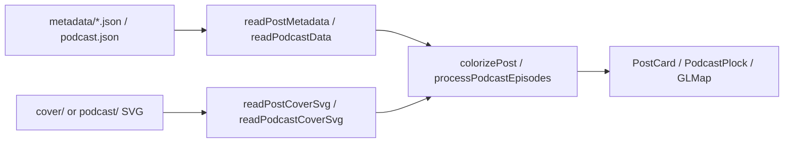

# Generated content (covers & metadata)

Generated artifacts live under `src/content/generated/` inside the `src/content` git submodule. Source markdown stays in `src/content/_docs/`.

## Layout

```
src/content/
├── _docs/                    # source blog posts (not generated)
└── generated/
    ├── metadata/               # per-post metadata JSON (city, geocode, colorSet, hash)
    ├── podcast.json          # podcast RSS feed snapshot
    ├── cover/                # post cover SVG traces
    └── podcast/              # podcast episode SVG traces
```

## Path constants (single source of truth)

All paths are defined in [`packages/consts/config.js`](../../../packages/consts/config.js):

| Constant | Path |
|----------|------|
| `CONTENT_GENERATED_DIR` | `src/content/generated` |
| `POST_METADATA_DIR` | `src/content/generated/metadata/` |
| `POST_COVER_DIR` | `src/content/generated/cover` |
| `PODCAST_JSON` | `src/content/generated/podcast.json` |
| `PODCAST_COVER_DIR` | `src/content/generated/podcast` |

Re-exported from `@/packages/consts`. **Never hardcode these paths elsewhere.**

- **Generators** import from `consts/config.js` for default output locations.
- **Readers** import from `consts/config.js` internally — consumers call reader functions instead.

## Generators

| Package | Command | Output |
|---------|---------|--------|
| `content-prepare` | `pnpm content:prepare` | `metadata/*.json` + `cover/*.svg` |
| `fetch-podcast` | `pnpm fetch:podcast` | `podcast.json` + `podcast/*.svg` |

Both use `packages/image-metadata` (`getColorSet`) to extract palette colors and write SVG edge traces. JSON stores `colorSet` (bg/title colors); SVG content is stored separately on disk.

### Post metadata (`content-prepare`)

- Input: `src/content/_docs/**/*.md` frontmatter (`city`, `cover`)
- Geocodes cities via `GOOGLE_API_KEY`
- Writes one `MetadataEntry` JSON per post under `metadata/` (basename mirrors cover SVG naming)
- Each entry includes a SHA-256 `hash` of the source markdown; unchanged posts are skipped
- `file` field = post id (slug under `_docs/`)
- Generates cover SVG when cover URL is new/changed

### Podcast data (`fetch-podcast`)

- Input: Anchor RSS feed (default URL in `fetch-podcast.ts`)
- Only processes **new** episodes; skips write if none
- Writes `{ channel, episodes, lastUpdated }` to `podcast.json`

## Reader functions (only access layer for reads)

Do **not** read generated files with inline `fs`/`path` in pages or API routes. Use these:

### Posts — [`packages/utils/post.ts`](../../../packages/utils/post.ts)

```ts
readPostMetadata(): PostMetadataEntry[] | undefined
readPostMetadataEntry(postId: string): PostMetadataEntry | undefined
readPostCoverSvg(postId: string): string | undefined
```

- `PostMetadataEntry`: `{ file, hash, city?, locations?, colorSet? }`
- Metadata filename: `{postId with / → -}.json` (e.g. `2017-01-26-dalian-modern-museum.json`)
- Cover SVG filename: `{postId with / → -}.svg` (e.g. `2017-01-26-dalian-modern-museum.svg`)

Used by `colorizePost()` (post card styling) and `src/pages/api/world/map.json.ts`.

### Podcast — [`packages/utils/podcast.ts`](../../../packages/utils/podcast.ts)

```ts
readPodcastData(): PodcastData
readPodcastCoverSvg(episodeSlug: string): string | undefined
processPodcastEpisodes(): PodcastEpisode[]   // enriches with trace SVGs
mapPodcastEpisodesToPosts(): T_PROPS[]       // maps to post shape for filters
```

- SVG filename: last URL path segment of episode id (e.g. `787-e2k41n4.svg`)
- Used by `src/pages/podcast.astro` and podcast filter/card components

## Runtime enrichment flow



Posts without `cover` frontmatter fall back to deterministic CSS gradient classes (`POST_CARD_CLASSNAMES`).

## Agent rules

1. **Adding/changing paths** → edit `packages/consts/config.js` only.
2. **Reading generated data** → use reader functions in `post.ts` / `podcast.ts`; never static-import JSON from `src/content/`.
3. **Regenerating data** → run `pnpm content:prepare` or `pnpm fetch:podcast`; do not hand-edit hundreds of SVGs.
4. **Tests** → import readers from `config.js` path (not `@/packages/consts` index) to avoid pulling MDX from hero fragments.
5. **Submodule** → generated files are committed inside `src/content`; bump submodule pointer in main repo after moves.

## CLI overrides

Both generators accept flags that override config defaults:

- `content-prepare`: `--docs-dir`, `--output`, `--trace-dir`
- `fetch-podcast`: `--rss-url`, `--output`, `--trace-dir`
