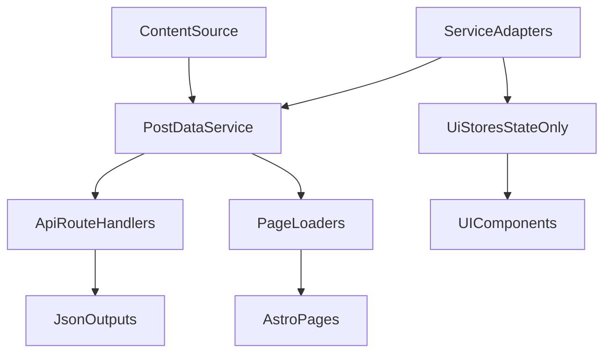

# SOLID Refactor + Faster Build Plan

## Goals
- Make code easier to read and change.
- Reduce coupling between `src` and `packages`.
- Cut build time by removing repeated heavy work.

## What we found
- Many pages and API routes are pre-rendered, and several use `getStaticPaths`, so build work is large.
- Some files mix too many jobs in one place (state + fetch + transform).
- A few files already show build pain (manual patch for slow build).
- Package boundaries are blurry (some package code imports from `src`, and one "const" area imports feature content).

Key files to target first:
- [/Volumes/Mac Data/github/blog.gongbushang.com/master/src/stores/search.ts](/Volumes/Mac Data/github/blog.gongbushang.com/master/src/stores/search.ts)
- [/Volumes/Mac Data/github/blog.gongbushang.com/master/src/stores/links.ts](/Volumes/Mac Data/github/blog.gongbushang.com/master/src/stores/links.ts)
- [/Volumes/Mac Data/github/blog.gongbushang.com/master/src/pages/api/[filter]/peak.json.ts](/Volumes/Mac Data/github/blog.gongbushang.com/master/src/pages/api/[filter]/peak.json.ts)
- [/Volumes/Mac Data/github/blog.gongbushang.com/master/src/pages/[category]/[year]/[month]/[day]/[slug].astro](/Volumes/Mac Data/github/blog.gongbushang.com/master/src/pages/[category]/[year]/[month]/[day]/[slug].astro)
- [/Volumes/Mac Data/github/blog.gongbushang.com/master/packages/utils](/Volumes/Mac Data/github/blog.gongbushang.com/master/packages/utils)
- [/Volumes/Mac Data/github/blog.gongbushang.com/master/packages/consts](/Volumes/Mac Data/github/blog.gongbushang.com/master/packages/consts)
- [/Volumes/Mac Data/github/blog.gongbushang.com/master/packages/header](/Volumes/Mac Data/github/blog.gongbushang.com/master/packages/header)

## SOLID direction (simple)
- **Single Responsibility**: split files that do many things into small units.
- **Open/Closed**: add extension points (small adapters) instead of editing big core files.
- **Liskov + Interface Segregation**: keep small interfaces for data providers and mappers.
- **Dependency Inversion**: page/UI code depends on small service interfaces, not direct heavy utils.

## Plan by phase

### Phase 1: Baseline and quick wins (low risk)
- Add build measurement script (`astro build` timing + route count + largest generated JSON size).
- Count and report hydration usage (`client:load`, `client:visible`, `client:idle`).
- Move obvious non-critical islands from `client:load` to `client:visible` or `client:idle`.
- Keep behavior same; this phase should only improve build/runtime cost.

### Phase 2: Separate responsibilities in `src/stores`
- In `search` store, split into:
  - `searchIndexService` (build/search index)
  - `searchDataService` (fetch posts)
  - `searchPvFilterService` (PV-based filtering)
  - thin UI store (state only)
- Do similar split for `links` store: aggregation logic moved to pure utility service.
- Add unit tests for each new service (small, pure tests).

### Phase 3: Remove repeated build work in API routes
- Create one shared post dataset builder/cache used by related API routes.
- Refactor routes like `api/[filter]/peak.json.ts` to use shared data and remove special patch logic.
- Review `getStaticPaths` routes and avoid recomputing same transforms in each route.

### Phase 4: Clarify package boundaries
- Stop imports from `packages/*` into `src/*` and back in mixed direction where possible.
- In `packages/consts`, separate "pure constants" from "feature content".
- In `packages/utils`, split high-fan-in helpers into smaller domains:
  - content read/parse
  - post mapping
  - filter/paging helpers
- Set a boundary rule: UI packages do not read app-level `src` internals.

### Phase 5: TypeScript build graph improvements
- Introduce project references for major internal groups (if we keep package split).
- Add `composite` + incremental config where needed.
- Use `tsc -b` for type-only workspace checks (fast re-check path).

### Phase 6: Validate and lock in
- Compare before/after build metrics.
- Add CI check for architecture rules (no forbidden cross-layer imports).
- Document structure rules in `AGENTS.md` (or a short architecture doc).

## Suggested target flow

## Decisions needed
- Choose migration style:
  - Option A: quick incremental refactor in-place (safer, slower progress).
  - Option B: create new modules first, then switch imports (cleaner, a bit more work).
- Choose build target:
  - Option A: reduce build time by 20% first.
  - Option B: reduce by 40% with deeper route/data changes.
- Choose package strategy:
  - Option A: keep current folder names, only enforce boundaries.
  - Option B: reorganize into clear groups (`ui`, `domain`, `data`, `apps`).
- Choose hydration policy default:
  - Option A: keep `client:load` unless proven safe.
  - Option B: default to `client:visible`/`client:idle`, opt-in to `client:load`.
- Choose TypeScript rollout:
  - Option A: add project references only for the heaviest areas first.
  - Option B: full workspace project references now.

## External guidance used
- Astro docs on hydration directives and streaming for better render/build behavior.
- TypeScript docs for project references and incremental build (`tsc -b`).
